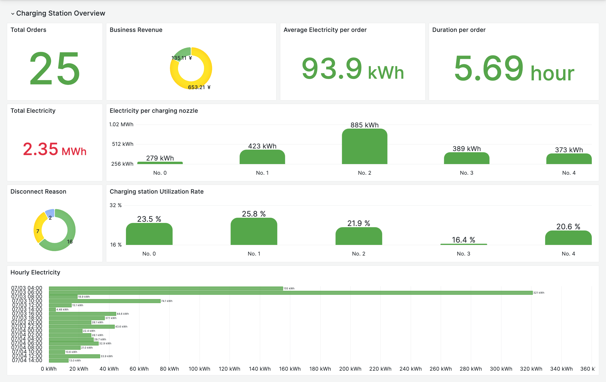

# mqtt-to-clickhouse

Ingesting time series & IoT data into ClickHouse using MQTT and EMQX | MQTT ClickHouse Integration

## Introduction

This tutorial will show you how to use MQTT to ingest IoT data into ClickHouse. We will be using the [EMQX](https://www.emqx.io/) MQTT broker to publish and subscribe to messages. We will also be using the [ClickHouse](https://clickhouse.com/) database to store the data.

With MQTT and ClickHouse, businesses can unlock the full potential of their IoT deployments. MQTT serves as the communication layer, facilitating the seamless data transfer from IoT devices to ClickHouse. ClickHouse, with its high-performance analytical capabilities, efficiently stores and processes incoming IoT data. The benefits of this combined solution include:

- Real-time Data Analytics: MQTT facilitates real-time data streaming from IoT devices to ClickHouse, ensuring the availability of up-to-date information for analysis.

- Scalability and Performance: ClickHouse's distributed architecture and columnar storage format, combined with MQTT's lightweight nature, enable seamless scalability and high-performance data processing.

- Efficient Storage: ClickHouse's columnar storage format optimizes storage requirements, allowing organizations to store and retain vast amounts of IoT data cost-effectively.

- Advanced Analytics: ClickHouse's powerful SQL-based query language and support for complex analytical functions empower users to gain valuable insights from IoT data, enabling predictive analytics, anomaly detection, and more.



This is a demo of an IoT-based car charging station. It utilizes EMQX to connect to the charging stations and uses MQTT to transmit their status and data. The data is stored in ClickHouse for real-time monitoring and analysis of the order count, charging duration, and charging status, providing insights into the usage frequency and charging demands of the charging stations.

You can also track the occupancy rate of the charging stations to evaluate their operational efficiency, which can serve as valuable decision-making information for market operations.

By integrating EMQX, ClickHouse, and relevant data analysis and visualization tools, you can build a powerful car charging station management system that enables real-time monitoring of charging station status and data, as well as data analysis and decision support.

## Architecture

<!--  -->

| Name      | Version | Description                                                                      |
| --------- | ------- | -------------------------------------------------------------------------------- |
| [EMQX Enterprise](https://www.emqx.com/en/products/emqx)      | 5.0.3+  | MQTT broker used for message exchange between MQTT clients and the ClickHouse. |
| [MQTTX CLI](https://mqttx.app/cli) | 1.9.3+  | Command-line tool used to generate simulated data for testing.        |
| [ClickHouse](https://clickhouse.com/)     | 23.6.1-alpine  | Charging station IoT data storage and management, as well as providing time aggregation and analysis capabilities for Grafana.      |
| [EMQX Exporter](https://github.com/emqx/emqx-exporter)      | 0.1 | Prometheus exporter for EMQX |
| [Prometheus](https://prometheus.io/)   | v2.44.0  | Open-source systems monitoring and alerting toolkit.       |
| [Grafana](https://grafana.com/)   | 9.5.1+  | Visualization platform utilized to display and analyze the collected data.       |

## How to use

<!-- 1. Init the submodule to get the EMQX Exporter  (Optional):

  ```bash
  git submodule init
  git submodule update
  ``` -->

1. Please make sure you have installed the [docker](https://www.docker.com/), and then running the following commands to start the demo:

  ```bash
  docker-compose up -d
  ```

  > You can quickly init submodule and start the demo by using the `make` command as well.

2. Running the following commands to see the message from MQTTX:

  ```bash
  docker logs -f mqttx
  ```

4. You can connect to ClickHouse and view the data by using the following command:

  ```bash
  docker exec -it clickhouse clickhouse-client --user admin --password public

  use iot_data;
  SELECT * FROM charging_record LIMIT 10;
  ```

5. If you want to alalysis the data in Grafana, you can open <http://localhost:3000> in your browser, and login with `admin:public`, and then add ClickHouse datasource and import the dashboard from `./grafana-dashboards/charging-station.json`.(Auto import is coming soon)

<!-- 5. (TODO) If you want to view the energy data and EMQX Metrics in Grafana dashboard, you can open <http://localhost:3000> in your browser, and login with `admin:public` -->

## License

[Apache License 2.0](./LICENSE)
